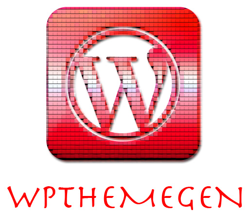

# wpthemegen
> Generate a wordpress theme fron a JSON config.  
> _Because nobody wants to write PHP._

> Using this will let you write wordpress themes using:  
* Jinja Templating
* HTML
* JSON config
* Any Javascript technology
* Any CSS technology

> ... and __a lot__ less _PHP_.

    

# __NOTE__
> __UNDER DEVELOPMENT, DO NOT USE IN PRODUCTION__

# How to install

    python setup.py install

# How to use
## First create a `config.json` file
> The config can look something like [this](examples/0/config.json)

## Generate the theme
> First initialize your template directory (__if it does not already exist__)

    wpthemegen --init true

> This will generate a `templates` directory with a basic layout.

> Now to actually generate the __Wordpress Theme__:
    
    wpthemegen --input config.json --output .

> This will generate a wordpress theme inside a directory with the same name
> as the `title` field in your `config.json`.  
> If your config has no `title` field, the directory will be named `WordpressTheme`

### Some theme examples using wpthemegen
* [Example 0](examples/0)
